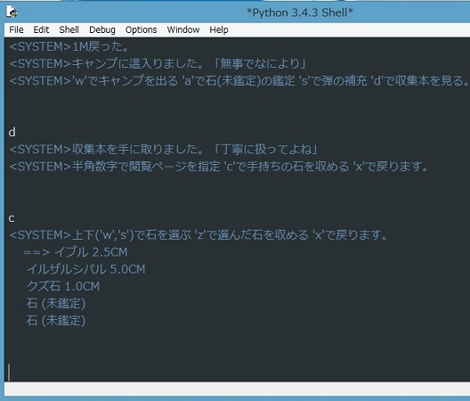
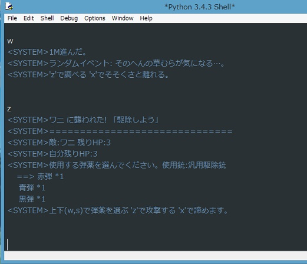

IssekiNichou
===

コンソールゲーム。草原を歩いて、害獣を駆除して、石を拾って、コレクションブックを完成させる。

- Docker: 対応!
- Python: 3.14!
- Linter: Ruff!
- Test: pytest!

## パッと実行してみたい

```bash
docker compose run --build --rm game
# 1 行ずつの表示で遊ぶ場合
docker compose run --build --rm -e ISSEKI_PLAIN=1 game
```

- Docker image をビルドして (ソースの変更も反映して) 、ゲームを対話モードで起動します。
- 最初に既存データの名前を入力するとロードします。 `make 名前` と入力すると新しいデータを作ります。
- 端末では画面が上から「現在地・距離・所持金・石の数・保存済み/未保存」「いまの場面」「最近の出来事」「使えるキー」の順に固定表示され、入力のたびに描き直されます。
- キーを入力して Enter を押します。フィールドでは `w` で進む、 `s` で戻る、 `c` でメニュー、 `q` で勲章、 `save` でセーブです。各画面で使えるキーは画面の一番下に表示されます。
- フィールドとキャンプでは `quit` で終了します。未保存の進行があるときは確認します。 `Ctrl-C` か `Ctrl-D` でも終了します。収集本に石を収めたとき以外は自動でセーブされないので、終了前に `save` します。
- パイプや `TERM=dumb` のときと、環境変数 `ISSEKI_PLAIN=1` を付けたときは、色や画面の描き直しを使わずに 1 行ずつ追記します。 `ISSEKI_TYPEWRITER=1` を付けると、この追記表示で会話文 (「」を含む行) を 1 文字ずつ表示します。
- セーブデータは Docker volume `isseki-data` の `/data/isseki.sqlite3` に残ります。初回はリポジトリの `app/isseki.sqlite3` がコピーされます。

lint 、テスト、脆弱性チェックは次のコマンドで実行します。

```bash
docker compose run --build --rm dev ruff check .
docker compose run --build --rm dev pytest
docker compose run --build --rm dev pip-audit
```

Docker を使わずにリポジトリのルートで `python3 KillBirds.py` を実行した場合は、 `app/isseki.sqlite3` を直接読み書きします。




